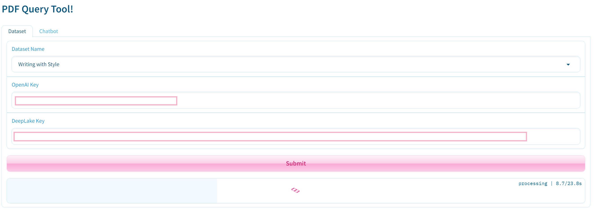
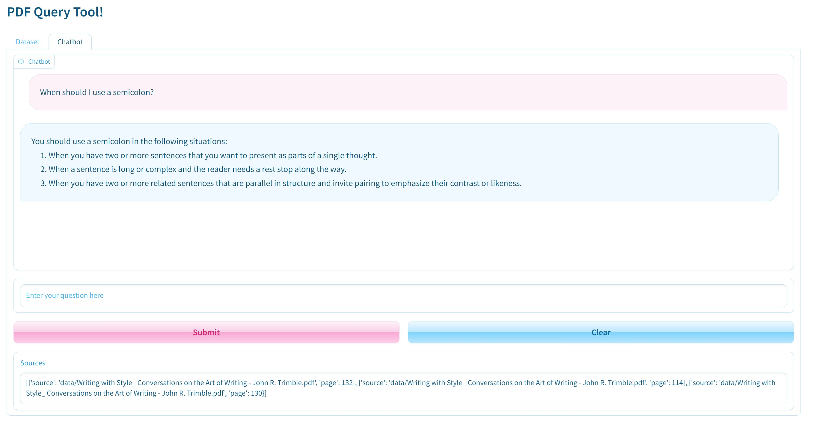

# Book-Question-Answering

This repository contains code for a chatbot that can answer questions about text from pdfs of books. It is still a WIP.

I've used Langchain to access OpenAI's GPT-3.5-Turbo as the LLM and Activeloop's DeepLake as a vector store for text embeddings. The UI is built with Gradio.

### Interface

---

### Planned Improvements

1. Remove hard-coded dataset options.
2. Add functionality to the UI that allows the user to choose their own dataset and upload their own books.
3. Improve chatbot output quality. Different embeddings?
